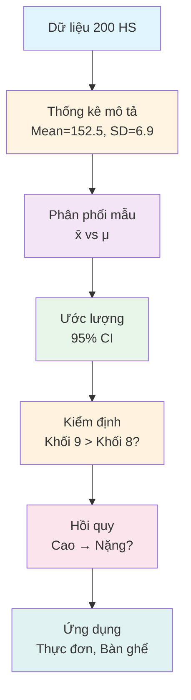

# KẾ HOẠCH NARRATIVE FLOW - MAS291 PROJECT
## Planning Document for Storytelling Presentation Version

---

## 🎯 MỤC TIÊU CHÍNH

### Vấn đề hiện tại (Feedback từ cô giáo)
- **Thiếu sự dẫn dắt**: Show công thức → Kết quả mà không giải thích TẠI SAO
- **Thiếu kết nối**: Các phần đứng độc lập, không có "câu chuyện" xuyên suốt
- **Thiếu ứng dụng thực tế**: Không rõ kết quả thống kê dùng để làm gì

### Mục tiêu Narrative Flow
- **Problem → Question → Solution → Application**
- Mỗi phần trả lời: Tại sao? Câu hỏi gì? Giải pháp gì? Áp dụng thế nào?
- Kết nối các phần bằng "cây cầu" logic

---

## 📋 CẤU TRÚC TỔNG THỂ

```
GIỚI THIỆU
    ↓
DỮ LIỆU (Tại sao cần?)
    ↓
THỐNG KÊ MÔ TẢ (Tóm tắt cái gì?)
    ↓
PHÂN PHỐI MẨU (Mẫu đại diện gì?)
    ↓
ƯỚC LƯỢNG (Từ mẫu → tổng thể?)
    ↓
KIỂM ĐỊNH (Sự khác biệt thật hay ngẫu nhiên?)
    ↓
HỒI QUY (Dự đoán cái gì?)
    ↓
TỔNG KẾT (Kết luận & Ứng dụng)
```

---

## 🎬 CHI TIẾT TỪNG PHẦN

### PHẦN 1: GIỚI THIỆU

**Narrative Arc:**
1. **Hook**: "Học sinh THCS ăn bao nhiêu? Cao bao nhiêu?"
2. **Problem**: Nhà trường muốn xây dựng thực đơn phù hợp nhưng không có dữ liệu
3. **Solution**: Đề xuất nghiên cứu thống kê 200 học sinh
4. **Roadmap**: Preview 8 phần sẽ đi từ dữ liệu → kết luận

**Key Questions:**
- Tại sao cần nghiên cứu này? → Thiết kế thực đơn
- Sẽ làm gì? → Thu thập dữ liệu → Phân tích → Kết luận

---

### PHẦN 2: DỮ LIỆU NGHIÊN CỨU

**Narrative Arc:**
```
VẤN ĐỀ (Real World)
  ↓ "Nhà trường muốn xây dựng thực đơn ăn trưa"
  ↓ "Khối 9 ăn nhiều hơn Khối 6 → Cần khẩu phần khác nhau"

CÂU HỎI NGHIÊN CỨU
  ↓ "Chiều cao & cân nặng phân bố như thế nào?"
  ↓ "Khối 9 cao/nặng hơn Khối 6,7,8 không?"
  ↓ "Chiều cao & cân nặng có liên quan không?"

THU THẬP DỮ LIỆU
  ↓ "Khảo sát 200 học sinh THCS thị trấn Đu"
  ↓ "Đo: Tên, Giới tính, Lớp, Năm sinh, Tuổi, Chiều cao, Cân nặng"
```

**Slide Structure:**
1. Slide 1: Vấn đề thực tế + 3 câu hỏi nghiên cứu
2. Slide 2: 5 hộp thông tin (Quy mô, Đo lường, Nguồn) + Biến thu thập
3. Slide 3: Show Excel data screenshot

---

### PHẦN 3: THỐNG KÊ MÔ TẢ

**Narrative Arc:**
```
PROBLEM
  ↓ "200 học sinh → 200 con số khác nhau"
  ↓ "Làm sao tóm tắt thành vài con số có ý nghĩa?"

SOLUTION: 3 Chỉ số chính
  ↓ Mean: "Giá trị điển hình" → Trung bình học sinh cao bao nhiêu?
  ↓ SD: "Độ phân tán" → Học sinh cao thấp chênh nhau nhiều không?
  ↓ Range: "Phạm vi" → Cần thiết kế bàn ghế, cửa, thực đơn như thế nào?

APPLICATION
  ↓ Mean = 152.5 cm → Cao hơn bàn tiểu học (~1m2)
  ↓ SD = 6.9 cm → Chênh lệch lớn giữa các HS
  → Cần nhiều size bàn ghế, thực đơn linh hoạt
```

**Slide Structure:**
1. Slide 1: Problem statement + 3 chỉ số (Mean, SD, Range) với icon + số lớn
2. Slide 2: Kết quả chi tiết (bảng 2 cột: Chiều cao, Cân nặng)
3. Slide 3: **NEW** Ý nghĩa kết quả (giải thích trong thực tế)

---

### PHẦN 4: PHÂN PHỐI MẨU

**Narrative Arc:**
```
CONCEPT
  ↓ "Tổng thể (Population) vs Mẫu (Sample)"
  ↓ "μ (thật) vs x̄ (mẫu) - Không bao giờ biết μ!"

SAMPLE A & B
  ↓ "Sample A = Khối 8 (n=50)"
  ↓ "Sample B = Khối 9 (n=50)"
  ↓ "Tại sao 2 mẫu? → Để so sánh & ước lượng"

KEY SYMBOLS
  ↓ x̄ = Sample Mean (trung bình mẫu) → Tính được
  ↓ μ = Population Mean (trung bình tổng thể) → Không bao giờ biết
  ↓ μ̂ = Estimator (ước lượng) → Dùng x̄ để ước μ
```

**Slide Structure:**
1. Slide 1: Show Sample A & B data image
2. Slide 2: Khái niệm Mẫu vs Tổng thể
3. Slide 3: **NEW** Ký hiệu thống kê (x̄, μ, μ̂) + Mối quan hệ

---

### PHẦN 5: ƯỚC LƯỢNG

**Narrative Arc:**
```
VẤN ĐỀ
  ↓ "Mean = 153.82 cm (chỉ 50 HS Khối 8)"
  ↓ "Nhưng toàn trường có 1000+ HS!"
  ↓ "Làm sao từ 50 con số → nói về TOÀN BỘ?"

SO SÁNH 2 PHƯƠNG PHÁP
  ↓ Point: 1 giá trị (μ̂ = 153.82)
    → Hạn chế: Không biết độ chính xác
  ↓ Interval: Khoảng + Độ tin cậy
    → 95% CI: [152.58; 155.06]
    → Tin 95% giá trị thật nằm trong khoảng này

CÔNG THỨC & ỨNG DỤNG
  ↓ CI = x̄ ± t × (s/√n)
  ↓ Áp dụng: x̄=153.82, s=4.36, n=50
  → 95% CI = [152.58; 155.06]

HÌNH Ả MINH HỌA
```

**Slide Structure:**
1. Slide 1: Problem statement (50 → 1000+?)
2. Slide 2: Point vs Interval so sánh
3. Slide 3: Kết nối đến Kiểm định
4. Slide 4: **NEW** Khoảng tin cậy là gì?
5. Slide 5: **NEW** Cấu trúc CI = x̄ ± t × (s/√n)
6. Slide 6: **NEW** Áp dụng cho Khối 8 (tính toán chi tiết)
7. Slide 7: Hình ảnh minh họa CI

---

### PHẦN 6: KIỂM ĐỊNH GIẢ THUYẾT

**Narrative Arc:**
```
PROBLEM
  ↓ "Khối 9 cao hơn Khối 8: 157.84 vs 153.82"
  ↓ "Chênh 4cm → Có Ý NGHĨA THỐNG KÊ không?"
  ↓ "Hay chỉ ngẫu nhiên?"

CONCEPT
  ↓ H₀: Không có sự khác biệt (chance)
  ↓ H₁: Có sự khác biệt thật (real)
  ↓ "T-test so sánh 2 trung bình"

RESULT
  ↓ t-value, p-value, CI
  ↓ "p < 0.05 → Bác bỏ H₀"
  → Có sự khác biệt có ý nghĩa thống kê!

APPLICATION
  ↓ "Khối 9 THỰC SỰ cao hơn Khối 8"
  → "Thực đơn Khối 9 cần nhiều hơn"
```

**Slide Structure:**
1. Slide 1: Problem - Sự khác biệt thật hay ngẫu nhiên?
2. Slide 2: Khái niệm H₀ vs H₁ (giải thích dễ hiểu)
3. Slide 3: Show hình data 2 mẫu so sánh
4. Slide 4: Kết quả t-test + Giải thích p-value
5. Slide 5: Kết luận & Ứng dụng

---

### PHẦN 7: HỒI QUY TUYẾN TÍNH

**Narrative Arc:**
```
PROBLEM
  ↓ "Chiều cao & Cân nặng có liên quan không?"
  ↓ "Cao → Nặng? Hay không liên quan?"

CONCEPT
  ↓ Correlation: Mối quan hệ
  ↓ Regression: Dự đoán
  ↓ "Dùng Chiều cao → Dự đoán Cân nặng"

RESULT
  ↓ r = 0.72 (correlation mạnh)
  ↓ Equation: Weight = α + β × Height
  ↓ R² = bao nhiêu % biến thiên được giải thích

APPLICATION
  ↓ "Dùng chiều cao → dự đoán cân nặng"
  → "Phát hiện bất thường: Cao nhưng quá nhẹ/gầy"
```

**Slide Structure:**
1. Slide 1: Problem - Cao có nặng không?
2. Slide 2: Scatter plot + Correlation concept
3. Slide 3: Regression equation + R²
4. Slide 4: Ứng dụng thực tế

---

### PHẦN 8: TỔNG KẾT

**Narrative Arc:**
```
HÀNH TRÌNH
  ↓ Dữ liệu → Thống kê mô tả → Ước lượng → Kiểm định → Hồi quy

KẾT QUẢ CHÍNH
  ↓ Chiều cao TB: 152.5 cm, SD: 6.9 cm
  ↓ Khối 9 > Khối 8: +4cm (có ý nghĩa thống kê)
  ↓ Chiều cao & Cân nặng: Correlation mạnh (r=0.72)

ỨNG DỤNG THỰC TẾ
  ↓ Thiết kế bàn ghế: Phạm vi 125-170cm
  ↓ Thực đơn: Khối 9 ăn nhiều hơn Khối 6
  ↓ Theo dõi sức khỏe: Phát hiện bất thường

HẠN CHẾ & ĐỀ XUẤT
  ↓ Chỉ khảo sát 1 trường → Cần mở rộng
  ↓ Không có dữ liệu theo thời gian → Cần longitudinal study
```

**Slide Structure:**
1. Slide 1: Infographic hành trình (Mermaid flowchart)
2. Slide 2: Key findings (3 phát hiện chính)
3. Slide 3: Ứng dụng thực tế
4. Slide 4: Hạn chế & Đề xuất
5. Slide 5: Cảm ơn + Q&A

---

## 🎨 DESIGN PRINCIPLES

### Visual Hierarchy
- **Hook**: Icon + Câu hỏi lớn (text-2xl, font-bold)
- **Problem**: Border-left color (yellow/amber for warning)
- **Solution**: Border-left color (green/blue for answer)
- **Application**: Border-left color (purple for real-world use)

### Animation Strategy
```
Click 1: Problem (VẤN ĐỀ)
  ↓
Click 2: Question (CÂU HỎI)
  ↓
Click 3: Solution (GIẢI PHÁP)
  ↓
Click 4: Application (ỨNG DỤNG)
```

### Color Coding
| Type | Color | Meaning |
|------|-------|---------|
| Problem | Yellow/Amber | Issue, warning, what's wrong |
| Question | Cyan/Blue | Inquiry, investigation |
| Solution | Green | Answer, formula, method |
| Application | Purple | Real-world use, impact |
| Data | Gray/White | Factual information |

---

## 📝 CHECKLIST PER SECTION

### Before showing FORMULAS:
- [ ] Why do we need this? (Problem)
- [ ] What question does it answer? (Question)
- [ ] Real-world context established?

### After showing RESULTS:
- [ ] What does this mean in plain language? (Interpretation)
- [ ] How does this help answer our original question? (Connection)
- [ ] What can we do with this information? (Application)

### Between sections:
- [ ] Bridge from previous section?
- [ ] Setup for next section?

---

## 🔗 CÁC CÂU KẾT NỐI (BRIDGES)

### PHẦN 2 → PHẦN 3
*"Đã có dữ liệu 200 con số → Bây giờ làm sao tóm tắt?"*

### PHẦN 3 → PHẦN 4
*"Đã biết Mean = 152.5, SD = 6.9 → Nhưng đây chỉ là 200 HS. Làm sao nói về toàn trường?"*

### PHẦN 4 → PHẦN 5
*"Đã hiểu x̄ vs μ → Bây giờ làm sao ước lượng μ từ x̄?"*

### PHẦN 5 → PHẦN 6
*"Đã có khoảng tin cậy → Bây giờ Khối 9 có THỰC SỰ cao hơn Khối 8 không?"*

### PHẦN 6 → PHẦN 7
*"Đã biết Khối 9 cao hơn → Nhưng Chiều cao & Cân nặng có liên quan không?"*

### PHẦN 7 → PHẦN 8
*"Đã đi qua hết các phân tích → Tổng hợp lại được gì?"*

---

## 📊 MERMAID FLOWCHART (CHO PHẦN 8)



---

## ✅ NEXT STEPS

1. **Review plan** with team → Approve structure
2. **Create new file**: `pages/mas291-narrative.md`
3. **Copy content** from `mas291-project.md` as base
4. **Rewrite each section** following narrative flow
5. **Test & Refine** → Get feedback

---

*Document created: 2026-03-17*
*Author: Claude & User collaboration*
*Version: 1.0*
